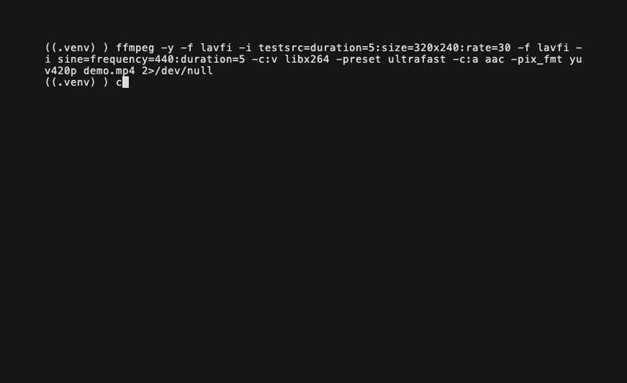

# CutAgent

**FFmpeg for AI agents** — every command returns structured JSON with recovery hints.

[](https://github.com/DaKev/cutagent/actions/workflows/ci.yml)
[](https://www.python.org/downloads/)
[](LICENSE)



CutAgent is designed from the ground up for **AI agents** and **programmatic video editing**. Every CLI command outputs structured JSON. Every operation is composable through a declarative Edit Decision List (EDL) format. No GUI, no human-formatted text — just clean machine-readable interfaces for professional video cutting.

## Why CutAgent?

- **Agent-first**: Every command returns structured JSON — built for LLM tool use, not human eyes
- **Declarative EDL**: Describe your edit as a JSON document, execute it in one call
- **Zero runtime dependencies**: Pure Python + FFmpeg — or `pip install 'cutagent[ffmpeg]'` to bundle everything
- **Content intelligence**: Scene detection, silence detection, audio levels, keyframe analysis, beat detection
- **Professional editing**: Trim, split, concat, reorder, extract, fade with crossfade transitions, speed control
- **Audio polish**: Mix background music, adjust volume, replace audio, normalize loudness (EBU R128)
- **Text & motion graphics**: Burn-in titles, lower-thirds, annotations, and keyframe-driven animations
- **Structured errors**: Error codes, recovery hints, and context in every failure response

| Dimension | CutAgent | MoviePy | ffmpeg-python | raw FFmpeg |
|-----------|----------|---------|---------------|------------|
| Output format | Structured JSON | Python objects / text | N/A (returns nothing) | Human text |
| Error handling | Codes + recovery hints | Exceptions | Exceptions | Unstructured stderr |
| Agent-friendly | Yes | Partial | No | No |
| Declarative EDL | Yes | No | No | No |
| Content intelligence | Scenes, silence, beats | Limited | No | Manual |
| Zero extra deps | Python + FFmpeg | NumPy, etc. | FFmpeg | FFmpeg |

## Requirements

- Python 3.10+
- FFmpeg and FFprobe (see setup options below)

## Installation

```bash
pip install cutagent
```

**With bundled FFmpeg (no separate install needed):**

```bash
pip install 'cutagent[ffmpeg]'
```

This uses [static-ffmpeg](https://pypi.org/project/static-ffmpeg/) to auto-download ffmpeg + ffprobe binaries on first use. Works on Windows, macOS (Intel + Apple Silicon), and Linux.

**From source (development):**

```bash
git clone https://github.com/DaKev/cutagent.git
cd cutagent
pip install -e ".[dev]"
```

## FFmpeg Setup

CutAgent needs `ffmpeg` and `ffprobe`. It searches for them in this order:

1. **Environment variables** `CUTAGENT_FFMPEG` / `CUTAGENT_FFPROBE` (exact path to binary)
2. **Environment variable** `CUTAGENT_FFMPEG_DIR` (directory containing both binaries)
3. **System PATH** (`ffmpeg` / `ffprobe` on `$PATH`)
4. **static-ffmpeg** package (if installed via `pip install 'cutagent[ffmpeg]'`)
5. **imageio-ffmpeg** package (ffmpeg only, if installed)

**Platform-specific install (if not using `cutagent[ffmpeg]`):**

| Platform | Command |
|----------|---------|
| macOS | `brew install ffmpeg` |
| Ubuntu/Debian | `sudo apt install ffmpeg` |
| Windows | `winget install ffmpeg` or `choco install ffmpeg` |

**Verify your setup:**

```bash
cutagent doctor
```

This checks for ffmpeg/ffprobe, reports versions, and flags any issues.

## Quick Start

### Python API

```python
from cutagent import probe, trim, execute_edl

# Inspect a video
info = probe("interview.mp4")
print(info.duration, info.width, info.height)

# Trim a segment
result = trim("interview.mp4", start="00:02:15", end="00:05:40", output="clip.mp4")

# Execute a full edit decision list
edl = {
    "version": "1.0",
    "inputs": ["interview.mp4"],
    "operations": [
        {"op": "trim", "source": "interview.mp4", "start": "00:02:15", "end": "00:05:40"},
        {"op": "trim", "source": "interview.mp4", "start": "00:12:00", "end": "00:14:30"},
        {"op": "concat", "segments": ["$0", "$1"]}
    ],
    "output": {"path": "highlight.mp4", "codec": "copy"}
}
result = execute_edl(edl)
```

### CLI (AI-Native — all output is JSON)

**AI agents: start here** — run `cutagent capabilities` to get the full machine-readable schema of all operations, a quality checklist, a phased workflow, and recipe examples for common video editing patterns.

```bash
# AI agents: start here — discover all operations, workflow, and recipes
cutagent capabilities
```

#### 1. Analyze

```bash
cutagent probe interview.mp4                     # Media metadata
cutagent summarize interview.mp4                  # Full content map (scenes + silence + suggested cuts)
cutagent scenes interview.mp4 --threshold 0.3     # Scene boundaries
cutagent silence interview.mp4                    # Silence intervals (dead air, pauses)
cutagent beats interview.mp4                      # Musical beats (for rhythm-aligned cuts)
cutagent keyframes interview.mp4                  # Keyframe positions
cutagent audio-levels interview.mp4               # Audio levels over time
```

#### 2. Edit

```bash
cutagent trim interview.mp4 --start 00:02:15 --end 00:05:40 -o clip.mp4
cutagent split interview.mp4 --at 00:05:00,00:10:00 --prefix segment
cutagent concat clip1.mp4 clip2.mp4 -o merged.mp4
cutagent speed interview.mp4 --factor 2.0 -o fast.mp4
cutagent extract interview.mp4 --stream audio -o audio.aac
```

#### 3. Audio Polish

```bash
cutagent normalize interview.mp4 -o normalized.mp4                          # EBU R128 loudness
cutagent mix interview.mp4 --audio music.mp3 --mix-level 0.2 -o with_music.mp4  # Background music
cutagent volume interview.mp4 --gain-db 6.0 -o louder.mp4                  # Volume adjustment
cutagent replace-audio interview.mp4 --audio voiceover.mp3 -o replaced.mp4 # Replace audio track
```

#### 4. Visual Polish

```bash
# Burn-in titles and lower-thirds
cutagent text interview.mp4 --entries-json '[{"text": "Interview Title", "position": "center", "font_size": 72, "start": "0", "end": "3"}]' -o titled.mp4

# Keyframe-driven animations (slide-in, fade-in)
cutagent animate interview.mp4 --layers-json '[{"type": "text", "text": "Hello", "start": 0, "end": 3, "properties": {"opacity": {"keyframes": [{"t": 0, "value": 0}, {"t": 0.5, "value": 1}]}}}]' -o animated.mp4

# Fade in/out for polished opening and closing
cutagent fade interview.mp4 --fade-in 1.0 --fade-out 1.0 -o faded.mp4
```

#### EDL and Validation

```bash
cutagent validate edit.json    # Dry-run validation
cutagent execute edit.json     # Execute the full edit
```

### EDL Format

The Edit Decision List is a declarative JSON format for multi-step edits. Operations run sequentially; `$N` references the output of operation N:

```json
{
  "version": "1.0",
  "inputs": ["interview.mp4", "broll.mp4", "background_music.mp3"],
  "operations": [
    {"op": "trim", "source": "$input.0", "start": "00:01:00", "end": "00:03:00"},
    {"op": "trim", "source": "$input.1", "start": "00:00:10", "end": "00:00:20"},
    {"op": "normalize", "source": "$0"},
    {"op": "fade", "source": "$1", "fade_in": 0.5, "fade_out": 0.5},
    {"op": "concat", "segments": ["$2", "$3"], "transition": "crossfade", "transition_duration": 0.5},
    {"op": "mix_audio", "source": "$4", "audio": "$input.2", "mix_level": 0.15}
  ],
  "output": {"path": "final.mp4", "codec": "libx264"}
}
```

**Available operations:** `trim`, `split`, `concat`, `reorder`, `extract`, `fade`, `speed`, `mix_audio`, `volume`, `replace_audio`, `normalize`, `text`, `animate`

## For Agent/MCP Authors

CutAgent exposes tool schemas and CLI commands designed for LLM tool use and MCP integration. Use `cutagent.tools` to get JSON schema definitions for your agent's tool registry, then invoke the CLI and parse the structured output.

```python
import json
import subprocess

# Get tool definitions for your LLM
from cutagent.tools import dump_all_schemas
schemas = json.loads(dump_all_schemas())

# Invoke CLI and parse JSON output
result = subprocess.run(
    ["cutagent", "probe", "video.mp4"],
    capture_output=True, text=True, check=False
)
info = json.loads(result.stdout)

# Validate EDL before execute
subprocess.run(["cutagent", "validate", "edit.json"], check=True)
```

## Screen Recording Pipeline

CutAgent doesn't capture screens — FFmpeg (its underlying engine) handles that part. Capture with FFmpeg, then immediately hand the file to CutAgent for post-production.

### Step 1: Record your screen with FFmpeg

**macOS (avfoundation)**

```bash
# List available devices first
ffmpeg -f avfoundation -list_devices true -i ""

# Record screen (device index 1) with system audio (device index 0)
ffmpeg -f avfoundation -i "1:0" -t 300 screen.mp4
```

**Linux (x11grab)**

```bash
# Full-screen capture at 1920×1080
ffmpeg -f x11grab -s 1920x1080 -r 30 -i :0.0 -t 300 screen.mp4
```

**Windows (gdigrab)**

```bash
# Full desktop capture
ffmpeg -f gdigrab -framerate 30 -i desktop -t 300 screen.mp4
```

### Step 2: Post-process with CutAgent

After recording, the typical cleanup steps are silence detection (to find dead air at the start/end or during pauses), trimming, and audio normalization.

```bash
# Inspect the recording
cutagent probe screen.mp4

# Find silence intervals (dead air, pauses)
cutagent silence screen.mp4 --threshold -35 --min-duration 0.5

# Get a full content map (scenes + silence + suggested cuts)
cutagent summarize screen.mp4

# Trim to the content window (remove intro/outro dead air)
cutagent trim screen.mp4 --start 00:00:02.1 --end 00:08:43.7 -o content.mp4

# Normalize audio loudness for streaming/sharing
cutagent normalize content.mp4 -o final.mp4
```

### Python pipeline example

This example auto-detects silence boundaries and builds the full post-processing pipeline programmatically:

```python
from cutagent import probe, detect_silence, execute_edl
from cutagent.models import format_time

recording = "screen.mp4"

# Detect intro/outro silence
silences = detect_silence(recording, threshold=-35.0, min_duration=0.5)

# Derive content window from first and last silence boundary
content_start = format_time(silences[0].end) if silences else "0"
content_end = format_time(silences[-1].start) if len(silences) >= 2 else format_time(probe(recording).duration)

# Build and execute the EDL: trim dead air → normalize audio
edl = {
    "version": "1.0",
    "inputs": [recording],
    "operations": [
        {"op": "trim", "source": "$input.0", "start": content_start, "end": content_end},
        {"op": "normalize", "source": "$0", "target_lufs": -16.0},
    ],
    "output": {"path": "final.mp4", "codec": "libx264"},
}

result = execute_edl(edl)
print(result.to_dict())
```

### EDL example — screen recording workflow

```json
{
  "version": "1.0",
  "inputs": ["screen.mp4"],
  "operations": [
    {"op": "trim",      "source": "$input.0", "start": "00:00:02.1", "end": "00:08:43.7"},
    {"op": "normalize", "source": "$0",       "target_lufs": -16.0},
    {"op": "text",      "source": "$1",
     "entries": [{"text": "Demo", "position": "bottom-right", "font_size": 32,
                  "start": "0", "end": "5", "font_color": "white"}]}
  ],
  "output": {"path": "final.mp4", "codec": "libx264"}
}
```

## Architecture

```
┌──────────────────────────────────────────────────────────────────┐
│                     cutagent (CLI / Python API)                  │
├──────────────────┬─────────────────┬─────────────────────────────┤
│  cli.py          │  engine.py      │  validation.py              │
│  JSON output     │  EDL execution  │  Dry-run validation         │
├──────────────────┼─────────────────┼─────────────────────────────┤
│  probe.py        │  operations.py  │  models.py                  │
│  Media analysis  │  Video ops      │  Typed dataclasses          │
│  + beat detect   │  audio_ops.py   │                             │
│                  │  Audio ops      │                             │
├──────────────────┴─────────────────┴─────────────────────────────┤
│  ffmpeg.py  (subprocess wrappers)  │  errors.py  (error codes)   │
└──────────────────────────────────────────────────────────────────┘
```

- **`ffmpeg.py`** is the only module that spawns subprocesses
- **`models.py`** and **`errors.py`** have zero internal dependencies
- All public functions return typed dataclasses, never raw dicts
- The CLI outputs JSON exclusively — designed for machine consumption

## Exit Codes

| Code | Meaning |
|------|---------|
| 0 | Success |
| 1 | Validation error (bad input, invalid EDL) |
| 2 | Execution error (FFmpeg failed) |
| 3 | System error (FFmpeg not found, permissions) |

## Error Handling

Every error includes a code, message, and recovery suggestions:

```json
{
  "error": true,
  "code": "TRIM_BEYOND_DURATION",
  "message": "End time 01:00:00 (3600.000s) exceeds duration (120.500s)",
  "recovery": [
    "Source duration is 120.500s — set end to 120.500 or less",
    "Run 'cutagent probe <file>' to check the actual duration"
  ],
  "context": {"source": "clip.mp4", "duration": 120.5, "end": "01:00:00"}
}
```

## Contributing

Contributions are welcome! Please read [CONTRIBUTING.md](CONTRIBUTING.md) for guidelines on:

- Setting up the development environment
- Architecture principles and code style
- Adding new operations
- The JSON output contract

## License

[MIT](LICENSE)
